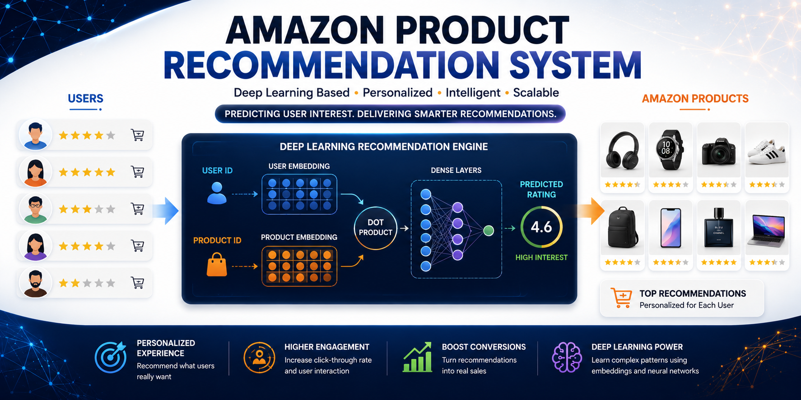
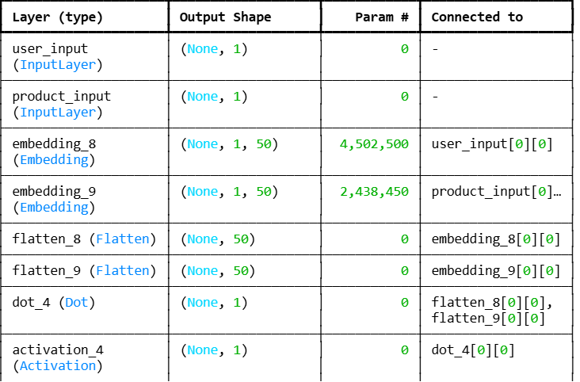

# 🛒 Amazon Product Recommendation System using Deep Learning

<p align="center">
  
</p>

<div align="center">

### Personalized Product Recommendation with Neural Collaborative Filtering


</div>

---

# 🌟 Project Highlights

✅ Recommendation System

✅ User Embeddings

✅ Product Embeddings

✅ Deep Learning Architecture

✅ Neural Collaborative Filtering

✅ Personalized Product Prediction

✅ Amazon Product Dataset

---

# 📖 Overview

Recommendation systems are among the most impactful applications of Artificial Intelligence and Machine Learning.

This project implements a Deep Learning-based recommendation engine capable of estimating a user's interest in a specific product using historical interaction patterns.

The system learns meaningful latent representations of both users and products through embedding layers and predicts personalized ratings using Neural Collaborative Filtering techniques.

---

# 🎯 Problem Statement

Given:

```text
User ID
Product ID
```

Predict:

```text
User Interest Score
```

or

```text
Expected Product Rating
```

This enables the recommendation of products that users are likely to prefer but have not yet interacted with.

---

# 🏗 Model Architecture

The recommendation engine uses a two-input neural network architecture.

### Workflow

```text
User ID
    │
    ▼
User Embedding
    │
    ▼
Flatten
    │
    ▼
         Dot Product
              │
              ▼
Product Embedding
              │
              ▼
           Flatten
              │
              ▼
       Sigmoid Output
              │
              ▼
Predicted Rating
```

---

## Architecture Visualization

<p align="center">
  
</p>

---

# 🧠 Why Embeddings?

Embedding layers allow the model to learn:

- Similar users
- Similar products
- Hidden customer preferences
- Latent product characteristics

Instead of relying on manually engineered features.

---

# 🔧 Data Preprocessing

The following preprocessing steps were applied:

### Label Encoding

User IDs and Product IDs were transformed into numerical representations using:

```python
LabelEncoder
```

### Feature Construction

- User Encoding
- Product Encoding
- Rating Normalization

---

# 🚀 Training Strategy

The model was trained using:

- Binary Cross Entropy Loss
- Adam Optimizer
- Validation Split
- Embedding Dimension = 50

---

# 💡 Business Applications

### 🛒 E-Commerce Platforms

Personalized product recommendations.

### 🎯 Customer Engagement

Increase click-through and purchase rates.

### 📦 Product Discovery

Expose users to relevant products.

### 💰 Revenue Optimization

Improve conversion and retention.

### 🤖 Intelligent Marketplaces

Automated recommendation pipelines.

---

# 🔬 Neural Collaborative Filtering

The model follows the principles of Collaborative Filtering:

```text
Users with similar preferences
        +
Products with similar audiences
        =
Better Recommendations
```

Instead of manually defining relationships, the model automatically learns them through embeddings.

---

# 🛠 Technologies Used

| Category | Technologies |
|-----------|-------------|
| Language | Python |
| Deep Learning | TensorFlow, Keras |
| Data Processing | Pandas, NumPy |
| Machine Learning | Scikit-Learn |
| Recommendation Systems | Neural Collaborative Filtering |
| Environment | Jupyter Notebook |

---

# 📂 Project Structure

```text
amazon-product-recommendation-system/
│
├── data/
│   └── README.md
│
├── images/
│   ├── project_banner.png
│   └── model_architecture.png
│   
│
├── notebooks/
│   └── what_to_buy.ipynb
│
├── README.md
├── requirements.txt
├── LICENSE
└── .gitignore
```

---

# ⚡ Installation

```bash
git clone https://github.com/moeinalva/amazon-product-recommendation-system.git
```

```bash
pip install -r requirements.txt
```

```bash
jupyter notebook
```

---

# 🔮 Future Improvements

- Matrix Factorization Comparison
- Neural Matrix Factorization (NeuMF)
- Hybrid Recommendation Systems
- Attention-Based Recommenders
- Real-Time Recommendation API
- Docker Deployment

---

# 👨‍💻 Author

## Moein Alva

Machine Learning & Deep Learning Enthusiast

Areas of Interest:

- Recommendation Systems
- Deep Learning
- Computer Vision
- Customer Analytics
- Financial AI

GitHub:

https://github.com/moeinalva

---

# 📄 License

This project is licensed under the MIT License.

---

<div align="center">

⭐ If you found this project useful, consider giving it a star.

🚀 Built with TensorFlow, Keras, and Recommendation System Techniques

</div>
